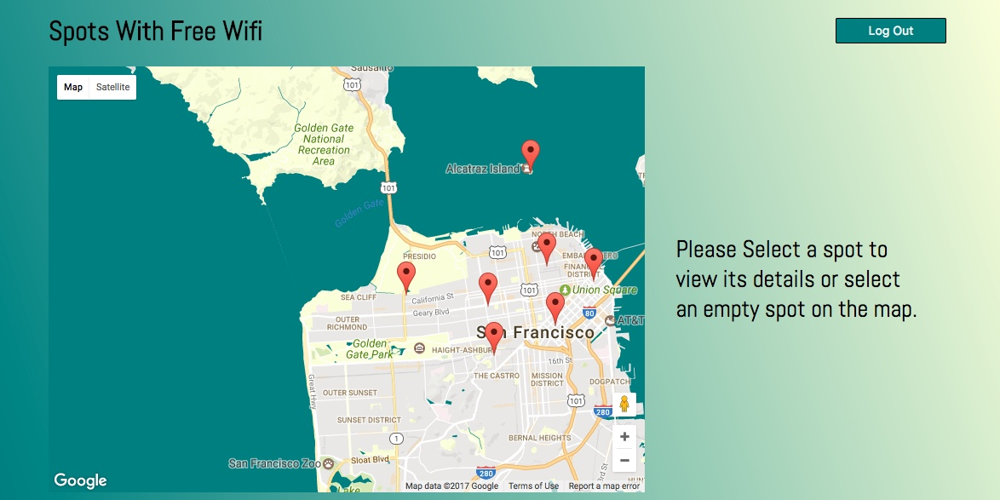
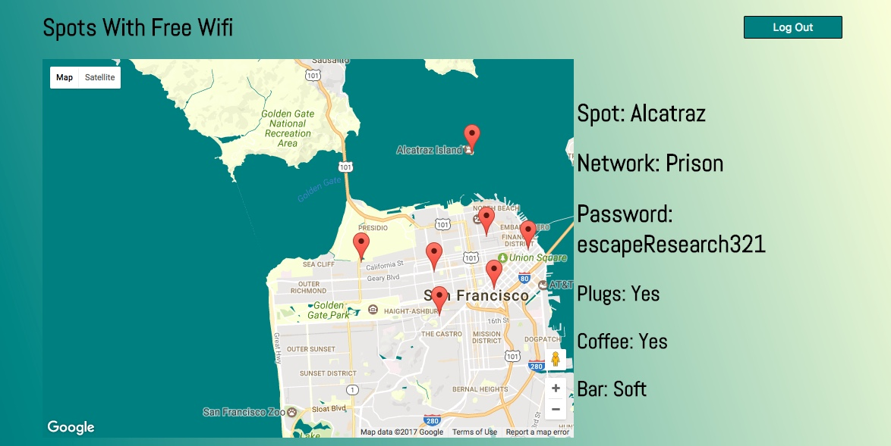
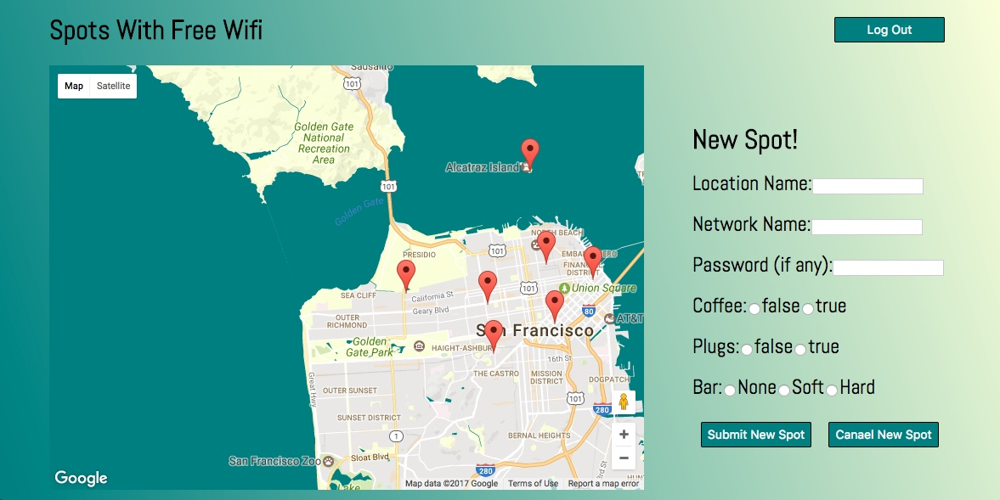
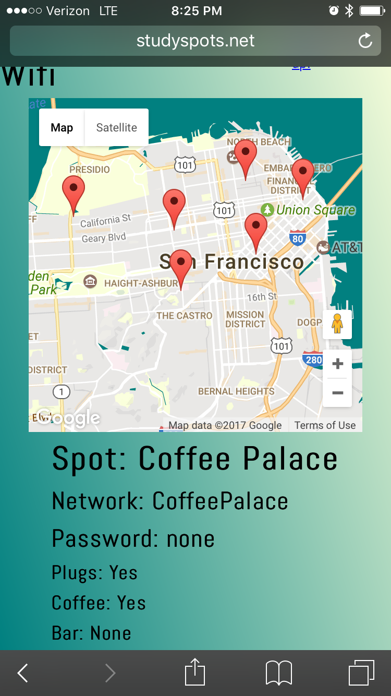

#StudySpots
[StudySpots Live](studyspots.net)

#Features & Implementation

## Map visualization
Using the Google Maps API and a Postgresql database I set up a system that allowed users to add a spot and all its details, such as if the spot has coffee or plugs, simply by clicking on the map.  React then re-renders the map, immedietly showing the new spot.  Also users can click on markers on the map to view the spot's details in the data area.  Again React keeps the whole page from having to reload.

#Mobile First Design
Due to the fact that people are usually on wifi when browsing the web using a laptop or desktop, I decided that I should design my site using the mobile first design philosophy.  To do this I added my react components to my page then used both Chromes emulator and my phone to hone my media queries.

##Authentication
In order to attempt to prevent abuses, I instituted a simple authentication that prevents a user from uploading sites without being signed in.  This Authentication is bootstrapped to the window so user will only have to sign in once so long as they do not clear their cookies.

##Areas for Future development.
As the site scales, it will become impractical to pull down all of the spot makers in the data base every time a user visits the site.  Thus I would like to eventually use the windows location property to only pull down spots in say a 20 mile radius.  I would also like to develop a rating and review system so that users can rate and review spots once they have selected one.
